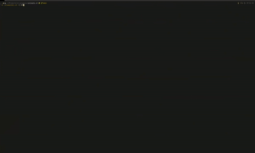

# Automata.sh
A simple implementation of some cellular automaton that run like a "ScreenSaver"
in the terminal. This was inspired by the very popular terminal screensaver Pipes.sh

## Features
- Conway's Game of Life (`life.sh`)
- Wolfram's Elementary Cellular Automaton (`elementary.sh`)
    - Supports all 256 rules, automatically picks one when ran without arguments
    - Supports passing a rule number as an argument
    - Allows passing of `-r` to specify a random seed location
    - Allows passing of `-t` to toggle a toroidal boundary (simulates an infinite grid)

## Demo


# License
This project is [MIT Licensed](LICENSE.md), all I ask is for credit in some form :)
## Installation
### Manual:
```bash
git clone https://github.com/Liam-Wirth/Automata.sh.git
cd life.sh
chmod +x life.sh elementary.sh
```

## Usage

### Conway's Game of Life

```bash
./life.sh
```

Press any key to exit.

### Elementary Cellular Automata

```bash
./elementary.sh [OPTIONS] [RULE_NUMBER]
```

### mazecetric
```bash
./mazecetric.sh
```

### Brians Brain
```bash
./brain.sh
```


#### Options

- `-r` : Use a random starting cell instead of the middle one
- `-t` : Use toroidal (wrap-around) boundaries
- `RULE_NUMBER` : Elementary CA rule (0-255). If omitted, uses a random rule

#### Examples

```bash
# Run with rule 30
./elementary.sh 30

# Run with rule 90 and random seed
./elementary.sh -r 90

# Run with rule 110 and toroidal boundaries
./elementary.sh -t 110

# Run with random rule, random seed, and toroidal boundaries
./elementary.sh -r -t
```
# TODOs/ Roadmap
+ These are all standalone scripts, which I like, but in the future I think it might be better to extract out common functionality
(they all basically use the same skeleton, which is just pasted from the first one I wrote, life.sh) to cut down on repeated code
+ Add more colors
+ Add optional "picker" ui or somethin
+ Add more "customization" to all of them (mazecetric, and brain don't have parameters that can be passed)